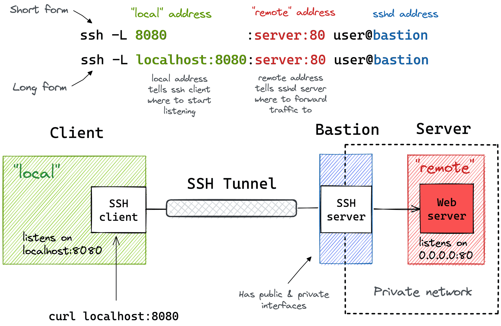
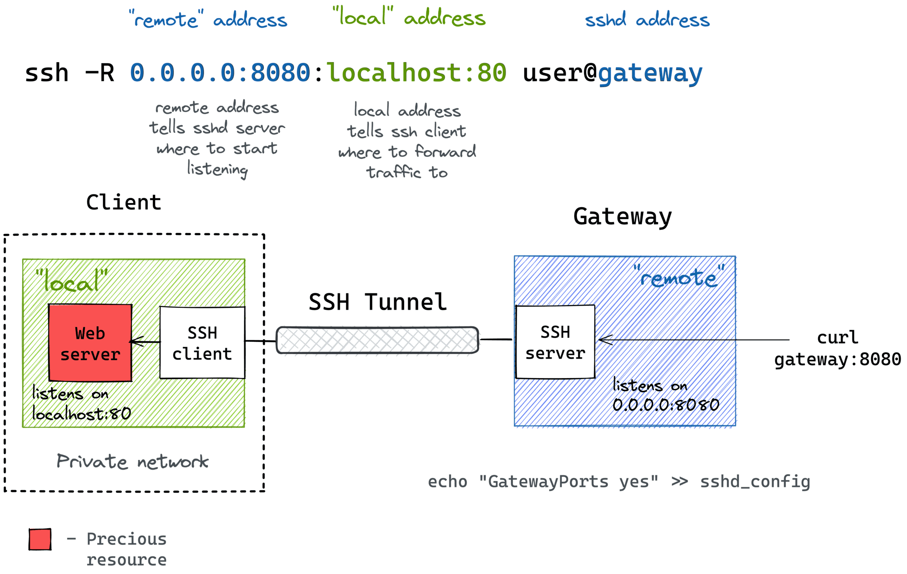

# SSH Tunnels 
SSH tunnels are a useful and interesting technology, they allow us to expose the SSH port (22) and route traffic for other services such as a HTTP (80) server through a SSH connection made with the SSH port.

This means we can direct a services traffic to a local port at one end of the SSH tunnel, and this data will be sent *through* the tunnel to the other end where a SSH Daemon will forward it to the final address, be that to a local or external service.

There are two types of SSH tunnels, those that preform *Local Forwarding*, and those that preform *Remote Forwarding*. The end result is often the same, however there are some differences to be aware of!

**Local Forwarding**: 

This method of forwarding allows us to forward traffic received *Locally* on the machine we *run the command on* to the remote target. We can use the following command:
```sh
$ ssh -L <Local-Port>:<Forward-Addr>:<Forward-Port> <User>@<Target-IP/Name>
```
* `ssh`: We are running a SSH command, so we need to specify the ssh executable.
* `-L`: Use this flag to specify Local Forwarding 
  * `<Local-Port>`: This specify the port we will listen for communications on our local machine
  * `<Forward-Addr>:<Forward-Port>`: This tuple specifies the Address(Domain Name), Port tuple the remote host will forward the traffic to this could be something like `localhost:80` for a service on the target machine, or something like `remote-server.internal:443` for a internal service that is not hosted on the target machine
* `<User>@<Target-IP/Name>`: This specifies the user we will log into, and the target remote machine. 

We can add two flags to put this in the background, allowing us to continue using our terminal on the local machine.
```sh
$ ssh -f -N -L <Local-Port>:<Forward-Addr>:<Forward-Port> <User>@<Target-IP/Name>
```
* `-f`: This flag puts ssh in the background (Just before execution)
* `-N`: This will not create a remote command terminal, we often use this when creating tunnels!


(Optional): We can also add a SSH-Key as shown below, or use the [SSH-Config](./../../Access/ssh%20config.md).
```sh
$ ssh -L <Local-Port>:<Forward-Addr>:<Forward-Port> <User>@<Target-IP/Name> -i <Path-To-Key>
```
* `-i`: This flag specifies that we will authenticate using the public/private key authentication
  * `<Path-To-Key>`: Specifies a path to a valid Private key, the public key paired with this must be located on the target system in the `~/.ssh/authorized_keys` file of the target user


**Remote Forwarding**: 
This method of forwarding allows us to forward traffic received on a *remote machine* to our local system which will then forward the traffic. This can be done with the following command:
```sh
$ ssh -R <Remote-Port>:<Forward-Addr>:<Forward-Port> <User>@<Target-IP/Name>
```
* `ssh`: We are running a SSH command, so we need to specify the ssh executable.
* `-L`: Use this flag to specify Local Forwarding 
  * `<Remote-Port>`: This specify the port we will listen for communications on our local machine
  * `<Forward-Addr>:<Forward-Port>`: This tuple specifies the Address(Domain Name), Port tuple your local host will forward the traffic to once it receives the communications from the remote system this could be something like `localhost:80` for a service on the our machine, or something like `remote-server.internal:443` for a internal service that is not hosted on our machine
* `<User>@<Target-IP/Name>`: This specifies the user we will log into, and the target remote machine. 

We can add two flags to put this in the background, allowing us to continue using our terminal on the local machine.
```sh
$ ssh -f -N -R <Local-Port>:<Forward-Addr>:<Forward-Port> <User>@<Target-IP/Name>
```
* `-f`: This flag puts ssh in the background (Just before execution)
* `-N`: This will not create a remote command terminal, we often use this when creating tunnels!


(Optional): We can also add a SSH-Key as shown below, or use the [SSH-Config](./../../Access/ssh%20config.md).
```sh
$ ssh -R <Local-Port>:<Forward-Addr>:<Forward-Port> <User>@<Target-IP/Name> -i <Path-To-Key>
```
* `-i`: This flag specifies that we will authenticate using the public/private key authentication
  * `<Path-To-Key>`: Specifies a path to a valid Private key, the public key paired with this must be located on the target system in the `~/.ssh/authorized_keys` file of the target user


[References for the images](https://iximiuz.com/en/posts/ssh-tunnels/)

Local Forwarding Image:



Remote Forwarding Image:


## References
* https://iximiuz.com/en/posts/ssh-tunnels/
* https://www.geeksforgeeks.org/difference-between-ssh-local-and-remote-port-forwarding/
